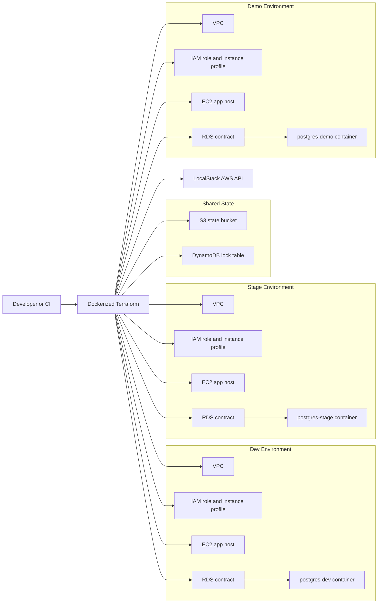

# Architecture

## Infrastructure diagram

## Module responsibilities

| Module | Purpose | Key outputs |
| --- | --- | --- |
| `remote_state` | Creates the Terraform state bucket and lock table | bucket name, lock table name |
| `network` | Creates VPC, public/private subnets, route table, IGW | VPC ID, subnet IDs |
| `security` | Creates app and database security groups | app SG, db SG |
| `iam` | Creates IAM role, inline policy, instance profile | role name, instance profile |
| `compute` | Creates the demo EC2 app host | instance ID, public/private IP |
| `rds` | Models the PostgreSQL dependency contract for the local demo | DB identifier, endpoint |

## Dependency wiring

1. `bootstrap` creates shared remote state resources.
2. Each environment root initializes its backend against that shared state.
3. `network` produces VPC and subnet IDs.
4. `security` uses the VPC ID to create app and DB security groups.
5. `iam` creates the role and instance profile used by the app host.
6. `compute` consumes the public subnet, app security group, and instance profile.
7. `rds` preserves the managed PostgreSQL contract and publishes environment-specific endpoints for the local PostgreSQL stand-ins in `dev`, `stage`, and `demo`.

## Why the database is emulated locally

LocalStack Community does not implement `RDS` APIs. Instead of turning the repo into documentation-only IaC, the lab keeps the AWS design, remote state flow, and module boundaries under Terraform, but routes the runnable local dependency to `postgres-dev`, `postgres-stage`, and `postgres-demo`. This keeps the project demoable while still making the trade-off explicit.
